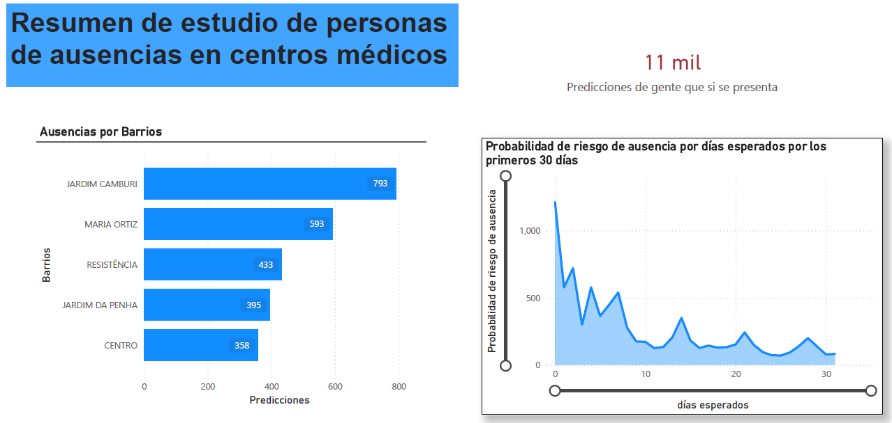

# Optimización Operativa en Salud: Predicción de Ausentismo (No-Show)

## Descripción del Proyecto
En la gestión de centros de salud, el ausentismo de pacientes (fenómeno conocido como "No-Show") genera pérdidas financieras directas, subutilización del personal médico y brechas en la atención sanitaria.

Este proyecto implementa un pipeline de datos end-to-end y un modelo de Machine Learning capaz de predecir la probabilidad de inasistencia de un paciente. El objetivo es proporcionar al equipo de operaciones una herramienta analítica para tomar acciones preventivas, como recordatorios personalizados o estrategias de sobre-agendamiento (overbooking) inteligente, optimizando así la ocupación de la agenda médica.

## Arquitectura de la Solución
El proyecto simula una arquitectura de Data Lake moderna (Medallion Architecture) para garantizar la escalabilidad y calidad del dato:

1.  **Capa Bronze (Ingesta):** Almacenamiento de datos crudos (`raw_data`) sin procesar.
2.  **Capa Silver (Procesamiento):** Limpieza de datos, estandarización y Feature Engineering avanzado. Se calculan variables históricas complejas y métricas de tiempo de espera para enriquecer el dataset.
3.  **Capa Gold (Consumo):** Generación de tablas enriquecidas con predicciones y probabilidades de riesgo, listas para ser consumidas por herramientas de Business Intelligence (Power BI) y analítica SQL.

## Stack Tecnológico

* **Lenguaje:** Python
* **Ingeniería de Datos:** Pandas (lógica optimizada para simulación de PySpark), NumPy.
* **Machine Learning:** Scikit-Learn (Random Forest Classifier, optimización de hiperparámetros).
* **Estrategia de Modelado:** Manejo de desbalance de clases mediante penalización de costos (`class_weight='balanced'`).
* **Analítica SQL:** DuckDB (simulación de consultas sobre Data Lake / AWS Athena).
* **Visualización y Dashboard:** Power BI, Matplotlib, Seaborn.
* **Control de Versiones:** Git & GitHub.

## Estructura del Repositorio
La organización del proyecto sigue estándares de ingeniería de software para facilitar la reproducibilidad:
* `data/`: Contiene los datasets en sus diferentes estados (raw, processed, final).
* `notebooks/`: Scripts de Jupyter para el desarrollo del ETL, análisis exploratorio (EDA) y entrenamiento del modelo.
* `img/`: Recursos gráficos y capturas de pantalla del proyecto.

## Estrategia de Modelado y Resultados

### Desafío Técnico
El dataset presenta un fuerte desbalance de clases (aproximadamente 80% asistencia vs 20% ausentismo). Un modelo estándar tendería a ignorar la clase minoritaria (ausentismo), maximizando la exactitud global pero fallando en el objetivo de negocio.

### Enfoque
Se implementó un modelo **Random Forest** optimizado con una estrategia de penalización de costos. Se priorizó deliberadamente la métrica de **Recall (Sensibilidad)** sobre la Precisión, bajo la premisa de negocio de que el costo de oportunidad de una cita perdida (falso negativo) es superior al costo operativo de una gestión preventiva (falso positivo).

### Métricas de Desempeño
* **Recall (Sensibilidad) de la Clase 1:** 79%. El modelo es capaz de detectar correctamente a casi 8 de cada 10 pacientes que faltarán a su cita.
* **Balanced Accuracy:** 67%. Rendimiento robusto muy superior al azar.

### Insights de Negocio
El análisis de importancia de variables reveló que el **Tiempo de Espera (`days_wait`)** es el predictor determinante (66% de importancia). Las citas programadas para el mismo día tienen una tasa de cumplimiento cercana al 96%, mientras que el riesgo de ausentismo aumenta drásticamente tras las primeras 24 horas de espera.

## Dashboard Operativo
Se diseñó un tablero de control en Power BI para el equipo de Call Center, permitiendo la gestión priorizada de pacientes según su probabilidad de riesgo.



**Hallazgos Clave Visualizados:**
1.  Identificación de zonas geográficas ("Barrios") con mayor incidencia de ausentismo para focalizar campañas de transporte o accesibilidad.
2.  Segmentación por riesgo temporal que valida la correlación entre días de espera y probabilidad de falta.

## Autor
**Jorge Sialer**
Estudiante de Ingeniería Mecatrónica (10mo Ciclo) - Pontificia Universidad Católica del Perú (PUCP)
* [Perfil de LinkedIn](www.linkedin.com/in/jorge-eduardo-sialer-kanamori-1806b2219)
* [GitHub](https://github.com/jorgesialer)

---
*Este proyecto fue desarrollado como iniciativa personal para demostrar competencias avanzadas en Data Engineering y Data Science aplicadas al sector salud.*
````